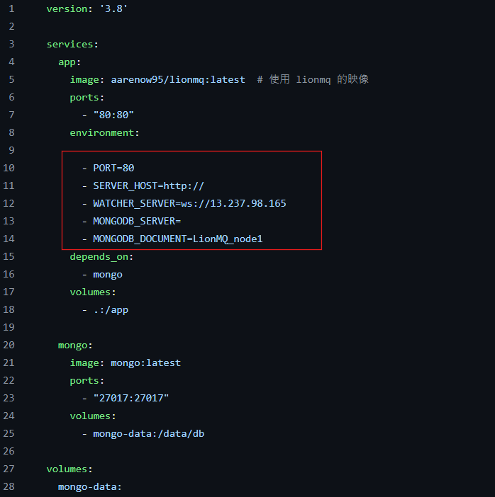

# LionMQ
LionMQ is a distributed message queue system composed of the following components:

* **[*LionMQ*](https://github.com/BackendAaren/LionMQ)**: The core message queue system handles message reception, storage, and distribution. It features failure requeue, auto-acknowledgment, and message persistence, with advanced capabilities such as high availability, dynamic scaling, and load balancing.

* **[*LionMQ Client*](https://www.npmjs.com/package/lionmq-clientside)**: The client library that provides an API for interacting with the LionMQ system. Users can publish, subscribe, control cluster system , and process messages through this library.

* **[*LionMQWatcher*](https://github.com/BackendAaren/LionMQ_watcher)**: A monitoring tool for the LionMQ system, offering real-time health monitoring, status updates, and performance metrics visualization.

# Contents
- [How to use LionMQ](#How-to-start-LionMQ-service)

# Demo
  

# Features
 * **High Availability**: LionMQ Cluster ensures message high availability via backup nodesa and MongoDB, replicating messages across nodes to prevent data loss during node failures.
   
 * **Horizontal Scaling**: LionMQ Cluster scales horizontally by adding nodes using Docker, with deployment simplified through a docker-compose.yml file, enhancing throughput as nodes manage connections and processing.
   
 * **Automatic Sharding**: LionMQ Cluster automatically shards queues across nodes, balancing load and optimizing performance through efficient resource utilization.
   
 * **Network Partition Tolerance**: LionMQ Cluster handles network partitions gracefully, resynchronizing data once the partition is resolved to ensure data integrity.
   
 * **Multi-Host Support**: LionMQ Cluster supports deployment across multiple hosts, improving reliability and scalability by enabling cooperative processing of messages.
   
 * **Dynamic Node Management**: [*LionMQ Client*](https://github.com/BackendAaren/LIONMQ_client) supports dynamic node management, allowing for non-disruptive scaling by adding or removing nodes as needed.
   
 * **Data Visualization and Real-Time Monitoring**:[*LionMQWatcher*](https://github.com/BackendAaren/LionMQ_watcher) provides comprehensive monitoring of each node's health status, tracks data processing progress within the message queues, and delivers detailed server metrics.
   
 * **Automatic Acknowledgment Mechanism**: LionMQ removes messages from the queue only upon receiving client-side acknowledgments. Backup nodes synchronize message processing statuses.
   
 * **Failover**: LionMQ provides seamless failover by automatically transferring queues from failed nodes to backup node, ensuring continuous availability.If a primary node fails, backup nodes retrieve pending messages from the database and reinsert them into the corresponding queue, ensuring seamless task continuity without message duplication.


# Architecture & Workflow
## Service

### LionMQ  

LionMQ is packaged with Docker and deployed to Docker Hub, supporting two modes.

   * Single node mode (Default)
     1.  **Message Persistence**: Messages are automatically persisted to MongoDB following enqueuing.
        
     2. **Automatic Acknowledgment**: LionMQ only removes messages from the queue after receiving acknowledgment from the client.
        
     3.  **Failure Replay Mechanism**: If LionMQ receives a reject message from the client or fails to receive acknowledgment within a predefined timeout, the message is requeued until successful processing or until the maximum retry limit is reached.
  * Cluster mode

    1. **Multimaster Architecture**: The cluster features multiple primary nodes, each with its own dedicated backup nodes for redundancy.
   
    2. **Load Balancing**: All primary nodes within the cluster automatically allocate different channels for processing tasks through a hashing mechanism.
   
    3. **Heartbeat Mechanism**: Each node in the LionMQ cluster continuously verifies the status of other nodes through network communication to ensure their availability.
   
    4. **Synchronous Backup**: Backup nodes synchronize all information from primary nodes, including the processing state of all messages.
   
    5. **Failover Resilience**: In the event of a primary node failure, standby nodes retrieve messages from the database and ensure that previously processed messages are not reprocessed.
   
    6. **Automatic State Synchronization**: All nodes in the cluster maintain a consistent view of the cluster’s state. Nodes that go offline due to failure are automatically updated with the current state information upon rejoining.
       
### LionMQ-Client

LionMQClient is an npm package that offers users streamlined operational mechanisms, encompassing four primary functionalities:

  1. Enqueue: Facilitates the connection to message sources and enqueues messages into LionMQ.

  2. Dequeue: Allows users to route messages to designated endpoints for processing or storage.

  3. Ack: Enables the incorporation of acknowledgment endpoints within the dequeue operation for message confirmation.

  4. Set-Nodes (Cluster): Provides functionality for users to configure the number of nodes and their primary-replica relationships within the cluster according to their needs.


### LionMQWatcher

LionWatcher is also packaged with Docker and operates based on WebSocket. Each node continuously sends message queue and group status information to LionMQWatcher in real-time. Combined with Chart.js, users can clearly view the status of each node.

1. Message Queue Metrics: Includes current queue length, message enqueue and dequeue counts, active message, message delay, inbound and outbound rates, and CPU and memory usage.

2. Node Status and IP Address: Provides the status and IP address of each node, indicating whether it is a Primary node, Backup node, or has experienced a failure.
 


# How to start LionMQ service

 ## 1. Start a LionMQ server  
#### Step 1:

Download the YAML file and run the `docker compose up` command in the terminal.
[LionMQ docker-compose.yml](https://github.com/BackendAaren/Appwork-Personal-Project/blob/main/docker-compose.yml)


#### Step 2:
**Refine and modify the configuration details within your docker-compose.yml file.**
 Environment Variables | Description | Example |
 ---------------- | --------| -----------------|
 ports            | Host Port: 80, Container Port: Same as the port you listen in container | 80:80
 PORT             | Enter the port listen in container you want | 80
 SERVER_HOST      | Enter your server IP | http://54.253.72.250
 WATCHER_SERVER   | Enter your LionMQ Watcher Server IP| ws://13.237.98.165
 MONGODB_SERVER   | Dependind you use MongoDB Atlas or MongoDB Compass  | [Atlas](https://cloud.mongodb.com/v2/666be7ef63c16005dcf78a8a#/overview), [MongoDB Compass](https://www.mongodb.com/products/tools/compass)
 MONGODB_DOCUMENT | Enter your the name that you want to show up on your mongodb document | LionMQ_node2
 
 <div style="text-align: center;">
    
 </div>

#### Step 3:
**Please ensure that your Docker services are fully operational and correctly initialized. Additionally, verify that the docker-compose.yml file is located within the directory where you intend to launch the project.**
```shell
docker compose up
```


 ## 2. Start a LionMQWatcher server
```shell
docker run -p <port> -e PORT=<Container Port> -e WATCHER_HOST=<SERVER_IP> aarenow95/lionmqwatcher
```
 Environment Variables | Description | Example |
 ---------------- | --------| -----------------|
 port | Host Port: 80, Container Port: Same as the port you listen in container | 80:80
 PORT             | Enter the port listen in container you want | 80
 SERVER_IP      | Enter your server IP | 13.237.98.165

> **Warning:** Make sure you start the **LionMQWatcher server** first before you start **LionMQ server**


 ## 3. Start a LionMQClient service
```shell
npm install lionmq-clientside
```
 Environment Variables | Description | Example |
 ---------------- | --------| -----------------|
 host | Enter your LionMQ server IP | "54.253.72.250"
 PORT | Enter the Host port you listen in LionMQ container | "80"

 > **Note:** For detailed operational commands and specifications, please consult the [*LionMQ Client*](https://github.com/BackendAaren/LIONMQ_client) documentation.

# Contact
Email: aaren.backend.ow95@gmail.com

LinkedIn: https://www.linkedin.com/in/%E5%8D%9A%E5%B4%B4-%E5%BC%B5-2a346b233/
